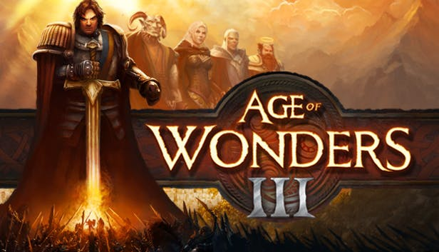
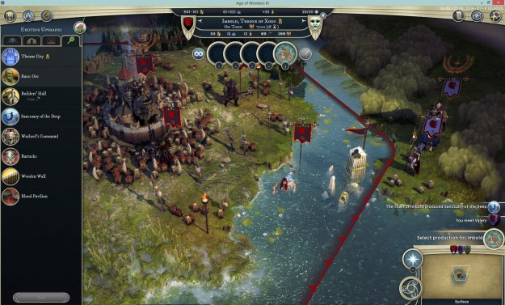
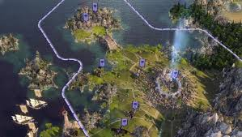

# Age Of Wonders III 

 

## À propos de ce jeu
**Age of Wonders III** est la suite tant attendue de la série de jeux de stratégie primée. Avec son mélange unique de construction d'empire, de jeu de rôle et de guerre, le tout dans un univers fantasy, Age of Wonders III propose le jeu de stratégie au tour par tout suprême pour les vétérans de la série comme pour les nouveaux joueurs !

**Créez un empire à votre image**    
- Incarnez l'une des 6 classes de dirigeants façon RPG : Sorcier, Théocrate, Conspirateur, Belliciste, Archidruide ou Machiniste, une classe portée sur la technologie.
- Découvrez de puissantes compétences spécifiques à votre classe afin de développer votre empire et votre arsenal.
- Choisissez vos alliés parmi les six races principales : Humains, Hauts-Elfes, Nains, Orcs, Gobelins et Draconiens, sans compter les monstres et leurs habitations propres.

**Explorez et exploitez un univers fantasy vivant**    
- Explorez un monde riche, plus détaillé et vivant que jamais, avec plus de 50 types de lieux où chercher des trésors.
- Étendez votre domaine en bâtissant de nouvelles colonies, concluez des pactes avec de monstrueux alliés et capturez de précieuses ressources.
- Utilisez une magie tellurique puissante pour terraformer les terres selon vos besoins.

**Menez des batailles tactiques en profondeur**      
- Recrutez des héros légendaires, procurez-leur des armes magiques, et laissez-les mener vos armées au combat.
- Écrasez vos ennemis grâce au système de combat tactique au tour par tour en 3D.
- Devenez un tacticien expert. Écrasez les défenses des villes, découvrez les avantages du débordement et maîtrisez les centaines de capacités de votre armée.

**Maîtrisez les nombreux modes d'Age of Wonders III !**      
- Plongez-vous dans le riche scénario de la campagne solo, jouable dans les deux camps d'un conflit épique.
- Créez une infinité de scénarios grâce au générateur de carte aléatoire.
- Affrontez jusqu'à 8 joueurs en ligne au cours de guerres multijoueurs.

**Quelques remarques :**      
- Les outils d'édition de niveaux sont fournis à titre gracieux pour les fans. La configuration requise peut être différente de celle du jeu Age of Wonders III, ils ne bénéficient pas de support technique, et leur interface est uniquement en anglais.
- Coop : les cartes aléatoires et scénarios indépendants permettent à des alliances de joueurs d'affronter des adversaires gérés par l'IA.
- Coop locale : les cartes aléatoires et scénarios indépendants permettent à des alliances de joueurs en mode hotseat sur le même ordinateur d'affronter des adversaires gérés par l'IA.

## About this game
**Age of Wonders III** is the long anticipated sequel to the award-winning strategy series. Delivering a unique mix of Empire Building, Role Playing and Warfare, Age of Wonders III offers the ultimate in turn-based fantasy strategy for veterans of the series and new players alike!

**Create an Empire in your own Image**
- Rule as one of 6 RPG style leader classes: Sorcerer, Theocrat, Rogue, Warlord, Archdruid, or the tech-focused Dreadnought.
- Research powerful skills unique to your class to develop your empire and arsenal.
- Choose your allies from among the six main races - Humans, High Elves, Dwarves, Orcs, Goblins and Draconians - and fantastical monster dwellings.

**Explore and Exploit a Living Fantasy World**
- Explore a rich fantasy world that is more detailed and alive than ever with over 50 location types to raid for treasure.
- Expand your domain by building new settlements, forge pacts with monstrous allies and capture valuable resources.
- Wield earth shattering magic and terra-form the lands for your needs.

**Fight In-depth Tactical Battles**
- Recruit legendary heroes, equip them with magical weapons, and let them lead your armies into battle.
- Crush your enemies using the detailed 3D turn-based Tactical Combat System.
- Become a master tactician. Crush city defenses. Learn to use flanking and master your army’s hundreds of abilities.

**Master Age of Wonders III’s many Modes!**
- Immerse yourself in a rich single player story campaign, playable from two sides of an epic conflict.
- Create endless scenarios using the random map generator.
- Compete in multiplayer wars with up to 8 players online.

**Please note that:**
- Level Editing Tools are provided as a courtesy to fans. They might have different system specifications from the Age of Wonders III game, are not tech supported and have an English only interface.
- Coop: Random maps and stand-alone scenarios can be played using player alliances versus computer opponents.
- Local Coop: Random maps and stand-alone scenarios can be played using “Hot Seat” mode on the same computer using player alliances versus computer opponents.

 

## Images

 

## Lien vers du gameplay / Link Toward Gameplay

[IGN Review](https://www.youtube.com/watch?v=CqmN6eGXi-k)   
[Gampeplay](https://www.youtube.com/watch?v=5yYh_2a-zQg)

 

### [Back to A-B index](/Steam/A-B/indexAB.html)  -  [Back to Steam index](/Steam/indexSteam.html)  -  [Back to homepage](/)
